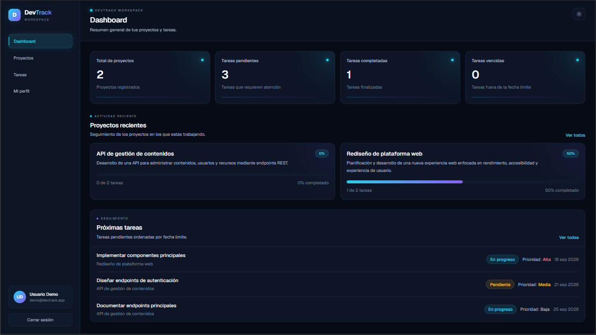
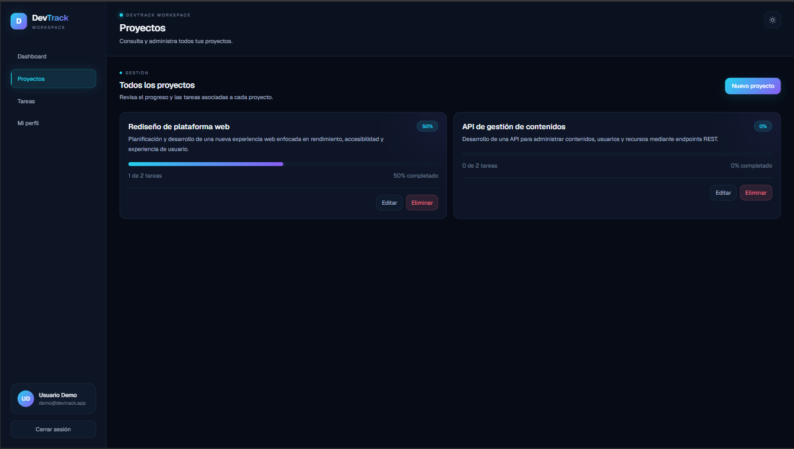
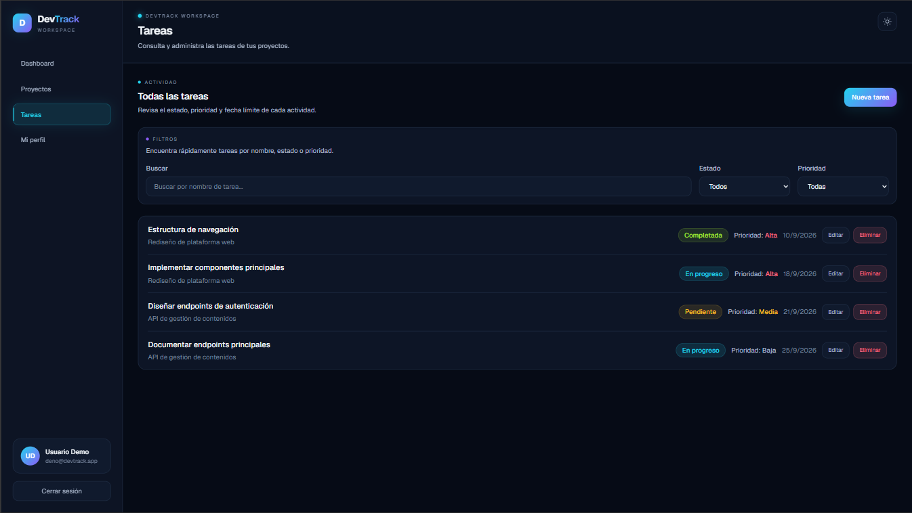

# DevTrack

DevTrack es una aplicación full-stack para la gestión de proyectos y tareas, desarrollada como proyecto de portafolio con enfoque en arquitectura, seguridad, validación de datos y buenas prácticas de desarrollo.

La aplicación permite que cada usuario administre sus propios proyectos y tareas dentro de una sesión autenticada, manteniendo aislados los datos entre usuarios.

## Demo en producción

**[Ver DevTrack en producción](https://dev-track-nine-delta.vercel.app)**

La aplicación se encuentra desplegada en Vercel y conectada a una base de datos persistente en Prisma Postgres.

## Vista general



El dashboard proporciona un resumen del estado de los proyectos y tareas del usuario, incluyendo proyectos registrados, tareas pendientes, completadas y vencidas, además del progreso de proyectos recientes y próximas actividades.

## Funcionalidades

- Registro e inicio de sesión de usuarios.
- Autenticación mediante sesiones JWT almacenadas en cookies HTTP-only.
- Gestión de perfil de usuario.
- Cambio seguro de contraseña.
- Creación, edición y eliminación de proyectos.
- Creación, edición y eliminación de tareas.
- Estados y prioridades para tareas.
- Fechas límite para tareas.
- Dashboard con resumen de proyectos y tareas.
- Búsqueda y filtrado de tareas por estado y prioridad.
- Tema claro y oscuro con preferencia persistente.
- Diseño responsive para escritorio y dispositivos móviles.
- Protección de recursos por propietario.
- Validación de datos en backend.
- Pruebas automatizadas de autenticación y API.

### Gestión de proyectos



Los proyectos permiten organizar el trabajo, consultar el número de tareas asociadas y visualizar su porcentaje de avance según las tareas completadas.

### Gestión de tareas



Las tareas pueden consultarse mediante búsqueda y filtros por estado o prioridad. Cada actividad mantiene su proyecto asociado, estado, prioridad y fecha límite.

## Tecnologías

### Frontend

- Next.js 16
- React 19
- TypeScript
- Tailwind CSS 4

### Backend

- Next.js App Router
- Route Handlers
- Prisma ORM
- Prisma Postgres

### Autenticación y seguridad

- JSON Web Tokens con `jose`
- Cookies HTTP-only
- Hash de contraseñas con `bcryptjs`

### Calidad y testing

- Vitest
- ESLint
- TypeScript
- Pruebas unitarias y de rutas API

## Arquitectura

DevTrack utiliza el App Router de Next.js y combina frontend y backend dentro de una misma aplicación.

La estructura principal se divide en:

```text
src/
├── app/
│   ├── api/
│   │   ├── auth/
│   │   ├── profile/
│   │   ├── projects/
│   │   └── tasks/
│   ├── login/
│   ├── profile/
│   ├── projects/
│   ├── register/
│   └── tasks/
├── components/
├── lib/
└── prisma/
```

## Modelo de datos

La aplicación utiliza tres entidades principales:

### User

Representa a los usuarios registrados en DevTrack.

Cada usuario puede tener múltiples proyectos.

### Project

Representa un proyecto perteneciente a un usuario.

Cada proyecto puede contener múltiples tareas.

### Task

Representa una tarea asociada a un proyecto.

Cada tarea contiene información como:

- título;
- estado;
- prioridad;
- fecha límite;
- proyecto asociado.

## Seguridad

DevTrack implementa aislamiento de datos por usuario.

Las operaciones sobre proyectos validan el `ownerId` del usuario autenticado antes de permitir modificaciones.

Las tareas se validan a través del proyecto al que pertenecen, evitando que un usuario pueda modificar, mover o eliminar tareas pertenecientes a otro usuario.

Las contraseñas nunca se almacenan directamente. Se procesan utilizando `bcryptjs`.

Las sesiones utilizan tokens JWT almacenados en cookies HTTP-only.

## Validación de tareas

Los estados permitidos actualmente son:

```text
Pendiente
En progreso
Completada
```

Las prioridades permitidas son:

```text
Alta
Media
Baja
```

También se valida:

- título obligatorio;
- fecha válida;
- proyecto válido;
- identificador de proyecto positivo.

## Pruebas

Actualmente el proyecto cuenta con pruebas para:

- creación y validación de sesiones;
- registro;
- inicio de sesión;
- cierre de sesión;
- perfil;
- cambio de contraseña;
- creación y consulta de proyectos;
- actualización y eliminación de proyectos;
- creación y consulta de tareas;
- actualización y eliminación de tareas;
- aislamiento de datos entre usuarios;
- validación de datos de tareas.

Actualmente la suite cuenta con:

```text
11 archivos de prueba
65 pruebas automatizadas
```

Para ejecutar todas las pruebas:

```bash
npm test
```

Para ejecutarlas en modo watch:

```bash
npm run test:watch
```

## Calidad de código

Ejecutar ESLint:

```bash
npm run lint
```

Comprobar TypeScript:

```bash
npm run typecheck
```

Generar el build de producción:

```bash
npm run build
```

## Instalación

Clona el repositorio:

```bash
git clone https://github.com/JC-ProyectosDigitales/DevTrack.git
```

Entra al proyecto:

```bash
cd DevTrack
```

Instala las dependencias:

```bash
npm install
```

## Variables de entorno

Crea un archivo `.env` en la raíz del proyecto.

Variables principales:

```env
DATABASE_URL=
AUTH_SECRET=
```

Para utilizar el script de usuario inicial también pueden configurarse:

```env
SEED_USER_NAME=
SEED_USER_EMAIL=
SEED_USER_PASSWORD=
```

El script de seed utiliza estas variables para crear un usuario inicial cuando sea necesario.

## Desarrollo local

Inicia el servidor de desarrollo:

```bash
npm run dev
```

Después abre en el navegador:

```text
http://localhost:3000
```

## Scripts disponibles

```text
npm run dev
npm run build
npm run start
npm run lint
npm run typecheck
npm test
npm run test:watch
npm run contract:emit
```

## Estado del proyecto

DevTrack cuenta actualmente con una versión funcional desplegada en producción.

El proyecto continúa en evolución como aplicación full-stack de portafolio.

Las áreas principales implementadas actualmente son:

- autenticación;
- administración de usuarios;
- proyectos;
- tareas;
- dashboard;
- diseño responsive;
- validación backend;
- aislamiento de datos por usuario;
- pruebas automatizadas.

## Objetivo del proyecto

DevTrack fue desarrollado como proyecto de portafolio para aplicar conceptos de desarrollo full-stack en una aplicación real.

El proyecto busca demostrar conocimientos en:

- desarrollo frontend con React y Next.js;
- creación de APIs con Route Handlers;
- manejo de bases de datos;
- autenticación;
- autorización;
- seguridad de contraseñas;
- validación de datos;
- diseño responsive;
- pruebas automatizadas;
- control de versiones con Git y GitHub.

## Autor

**Diego de Jesús Castillo Andrade**

GitHub:

[JC-ProyectosDigitales](https://github.com/JC-ProyectosDigitales)

---

Desarrollado con Next.js, TypeScript, Prisma y PostgreSQL.
